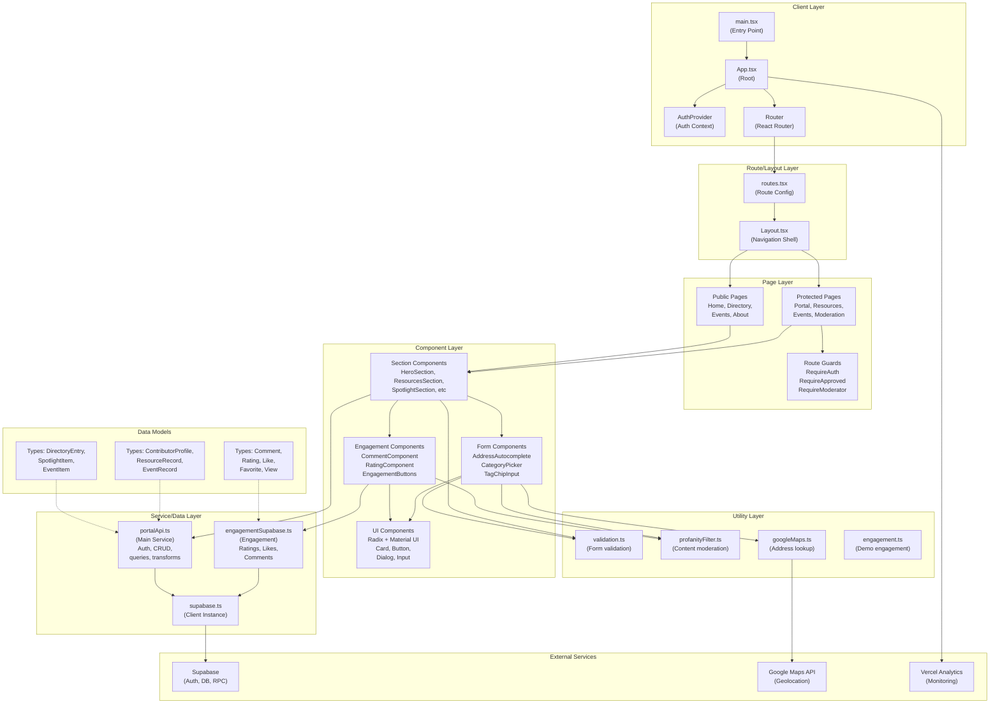
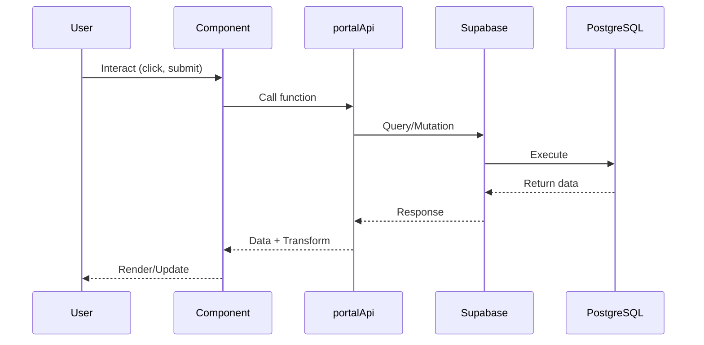
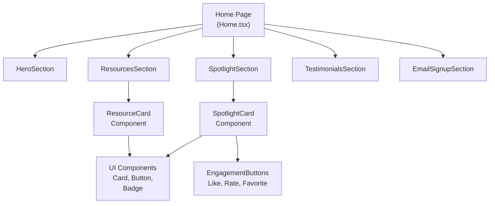
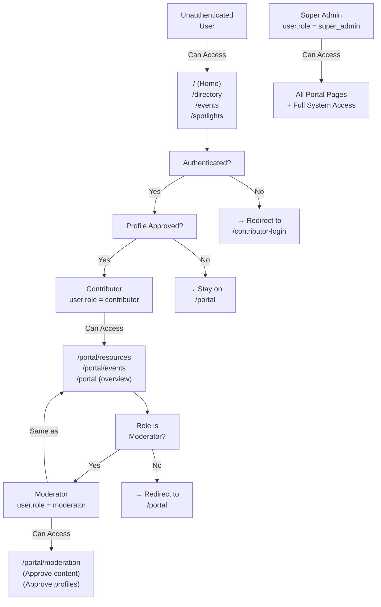
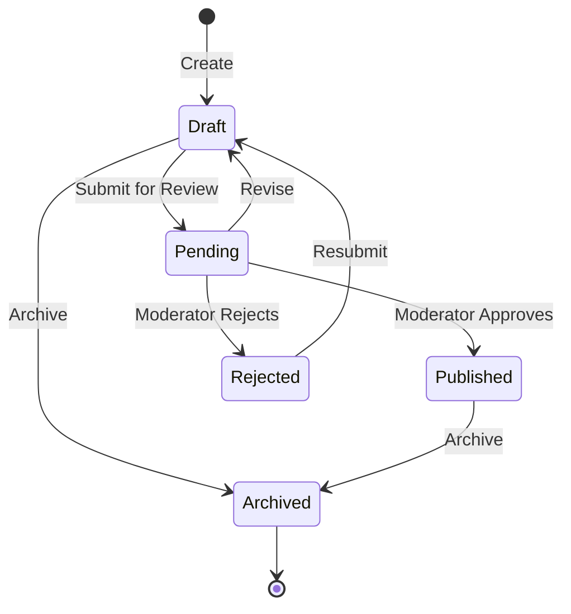
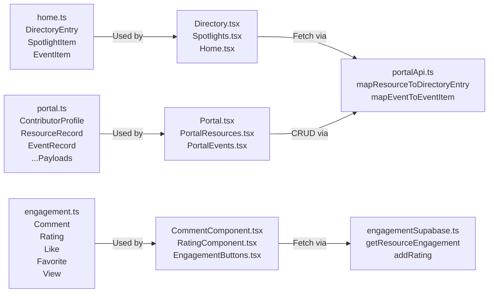

# Architecture Diagram (Mermaid)

## High-Level Application Architecture



## Data Flow Patterns



## Authentication Flow

```mermaid
graph LR
    Login["User at<br/>/contributor-login"]
    Submit["Submit email<br/>+ password"]
    SignIn["signInContributor()"]
    Auth["Supabase.auth"]
    Check["AuthProvider detects<br/>session change"]
    Profile["Load profile<br/>via getProfile()"]
    Context["Update AuthContext<br/>session, user, profile, role"]
    Dashboard["Redirect to<br/>/portal"]

    Login --> Submit
    Submit --> SignIn
    SignIn --> Auth
    Auth --> Check
    Check --> Profile
    Profile --> Context
    Context --> Dashboard
```



## Component Hierarchy (Home Page Example)



## Role-Based Access Control (RBAC)



## Resource Lifecycle (Contributor)



## Service Dependencies

```mermaid
graph TB
    Component["Components<br/>(UI Layer)"]
    Portal["portalApi.ts<br/>(Main Service)"]
    Engagement["engagementSupabase.ts<br/>(Engagement Service)"]
    Validation["validation.ts<br/>(Validation)"]
    Profanity["profanityFilter.ts<br/>(Moderation)"]
    GoogleMaps["googleMaps.ts<br/>(Geolocation)"]
    Client["supabase.ts<br/>(Supabase Client)"]
    Supabase["Supabase API<br/>(Backend)"]

    Component -->|Uses| Portal
    Component -->|Uses| Engagement
    Component -->|Uses| Validation
    Component -->|Uses| Profanity
    Component -->|Uses| GoogleMaps

    Portal -->|Uses| Client
    Engagement -->|Uses| Client
    Validation -->|Standalone|
    Profanity -->|Standalone|
    GoogleMaps -->|Uses| Supabase

    Client -->|Connects to| Supabase
```

## Type System Overview


